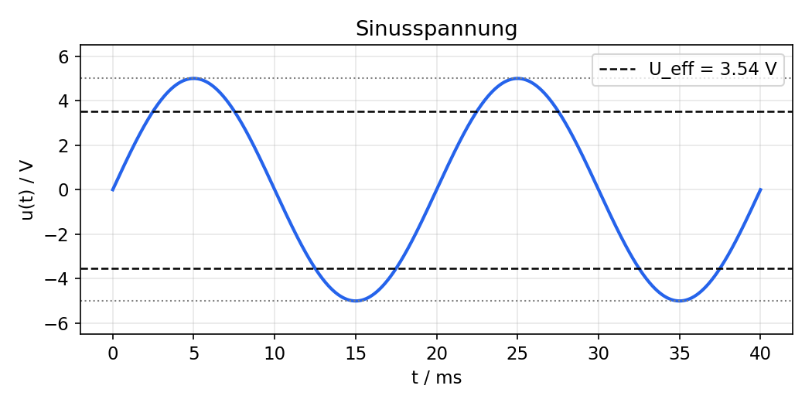
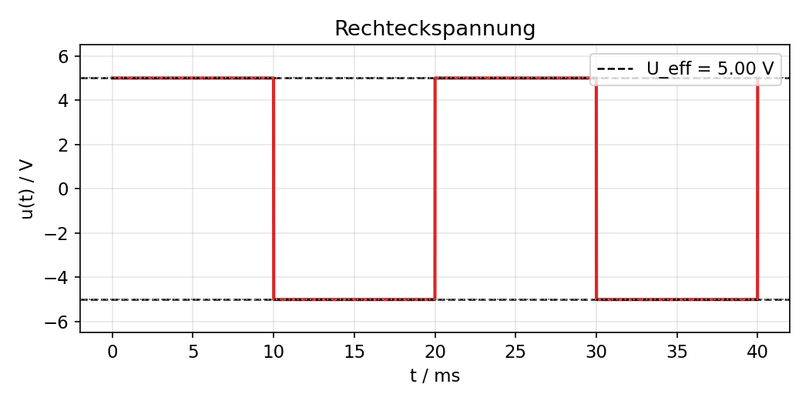
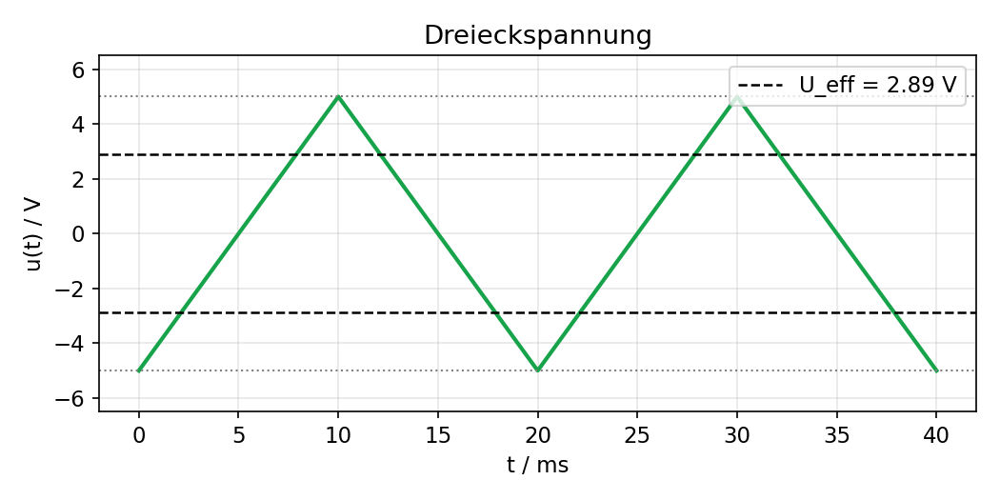
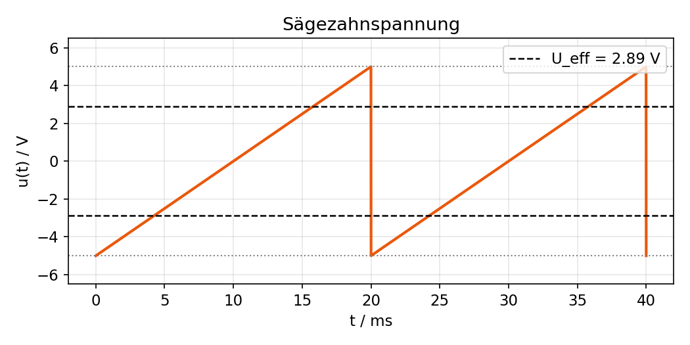
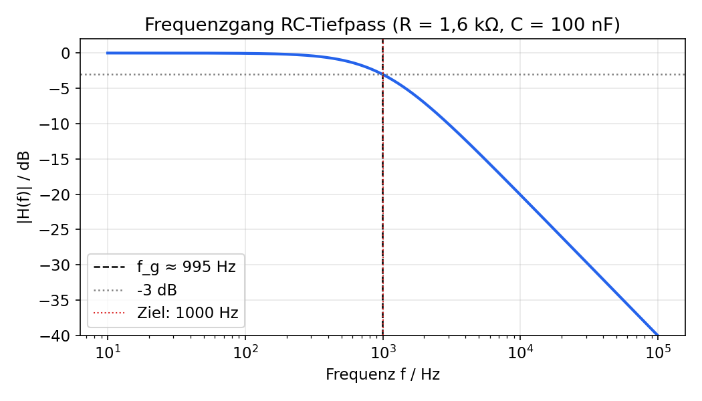

# Analoge Signale – Vertiefung

**Dokumentation zu den Erweiterten Inhalten**

---

## 1. Effektivwerte verschiedener Signaltypen

### 1.1 Definition

Der **Effektivwert** $U_{eff}$ (auch RMS – *Root Mean Square*) ist jener Gleichspannungswert, der an einem ohmschen Widerstand **dieselbe Wirkleistung** (denselben Energieumsatz) erzeugen würde wie das tatsächliche, zeitlich veränderliche Signal. Er wird berechnet, indem man das Signal **quadriert**, über eine Periode **mittelt** und daraus die **Wurzel** zieht:

$$U_{eff} = \sqrt{\frac{1}{T}\int_0^T u(t)^2\,dt}$$

Im Folgenden sind alle vier Signalformen mit einem **Spitzenwert $U_0 = 5\,V$** dargestellt. Die gestrichelte Linie zeigt jeweils den berechneten Effektivwert, die gepunktete Linie den Spitzenwert.

### 1.2 Sinusspannung



$$U_{eff} = \frac{U_0}{\sqrt{2}} = \frac{5\,V}{\sqrt{2}} \approx 3{,}54\,V$$

**Warum:** Es gilt die Identität $\sin^2(x) = \tfrac{1}{2}\left(1-\cos(2x)\right)$. Über eine volle Periode gemittelt verschwindet der $\cos(2x)$-Anteil, übrig bleibt der Mittelwert $\tfrac12$. Damit ist der quadratische Mittelwert $U_0^2 \cdot \tfrac12$, und die Wurzel daraus ergibt $U_0/\sqrt2$.

### 1.3 Rechteckspannung



$$U_{eff} = U_0 = 5{,}00\,V$$

**Warum:** Der Momentanwert ist zu jedem Zeitpunkt entweder $+U_0$ oder $-U_0$ – der Betrag ist also konstant. Damit ist auch $u(t)^2$ konstant gleich $U_0^2$, der Mittelwert über die Periode bleibt $U_0^2$, und die Wurzel daraus ist wieder $U_0$. **Bei Rechtecksignalen ist der Effektivwert gleich dem Spitzenwert.**

### 1.4 Dreieckspannung



$$U_{eff} = \frac{U_0}{\sqrt{3}} = \frac{5\,V}{\sqrt{3}} \approx 2{,}89\,V$$

**Warum:** Der Momentanwert steigt und fällt linear zwischen $-U_0$ und $+U_0$. Normiert man die Zeitachse auf $x \in [-1,1]$, so ist der quadratische Mittelwert von $x^2$ gleich $\tfrac13$ (Integral von $x^2$ über $[-1,1]$, normiert auf die Intervallbreite). Damit folgt $U_{eff} = U_0/\sqrt3$.

### 1.5 Sägezahnspannung



$$U_{eff} = \frac{U_0}{\sqrt{3}} = \frac{5\,V}{\sqrt{3}} \approx 2{,}89\,V$$

**Warum:** Auch hier verläuft die Spannung linear von $-U_0$ bis $+U_0$ (nur springt sie am Ende der Periode schlagartig zurück, statt symmetrisch wieder abzufallen). Da das Quadrieren und zeitliche Mitteln **unabhängig von der Reihenfolge** der Werte ist, ergibt sich exakt derselbe Effektivwert wie bei der Dreieckspannung – nur der **Verlauf**, nicht aber die **Verteilung** der Spannungswerte über die Periode, unterscheidet sich.

### 1.6 Übersicht und Scheitelfaktor

Der **Scheitelfaktor** (Crest-Faktor) $k = U_0 / U_{eff}$ beschreibt, wie "spitz" ein Signal im Verhältnis zu seinem Energiegehalt ist:

| Signalform | $U_{eff}$ bei $U_0=5V$ | Scheitelfaktor $k$ |
|---|---|---|
| Sinus | 3,54 V | $\sqrt2 \approx 1{,}414$ |
| Rechteck | 5,00 V | $1{,}000$ |
| Dreieck | 2,89 V | $\sqrt3 \approx 1{,}732$ |
| Sägezahn | 2,89 V | $\sqrt3 \approx 1{,}732$ |

**Bedeutung des Scheitelfaktors:** Er zeigt, wie stark die Spitzenbelastung (z. B. Spannungsfestigkeit von Bauteilen, Isolation) von der "mittleren Leistung" abweicht. Ein Rechtecksignal mit $k=1$ belastet ein Bauteil im Verhältnis zur übertragenen Leistung am wenigsten an der Spitze, während spitze Signale (Dreieck, Sägezahn, erst recht Impulse) bei gleicher Leistung deutlich höhere Spitzenspannungen erzeugen. In Messgeräten ist der Scheitelfaktor wichtig, um zu wissen, ob ein einfaches Gleichrichter-Messgerät (oft nur für Sinus kalibriert) oder ein **True-RMS-Messgerät** nötig ist.

---

## 2. Widerstandsarten bei sinusförmiger Wechselspannung

Bei Wechselspannung gibt es drei grundsätzlich verschiedene Widerstandsarten:

| Widerstandsart | Formel | Phasenverschiebung $u$ zu $i$ |
|---|---|---|
| Ohmscher Widerstand $R$ | $R$ (frequenzunabhängig) | $0°$ |
| Induktiver Widerstand $X_L$ | $X_L = \omega L = 2\pi f L$ | $u$ eilt $i$ um $90°$ voraus |
| Kapazitiver Widerstand $X_C$ | $X_C = \dfrac{1}{\omega C} = \dfrac{1}{2\pi f C}$ | $i$ eilt $u$ um $90°$ voraus |

### 2.1 Warum ist der Widerstand einer Spule bei Wechselspannung größer als bei Gleichspannung?

Bei **Gleichspannung** ($f=0$) ist der Strom konstant, es gibt keine Stromänderung – eine ideale Spule wirkt daher wie ein Kurzschluss (nur die ohmsche Drahtwicklung bremst noch). Bei **Wechselspannung** ändert sich der Strom laufend. Nach dem Induktionsgesetz

$$u_L(t) = L \cdot \frac{di}{dt}$$

induziert jede Stromänderung eine Gegenspannung (Selbstinduktion, Lenz'sche Regel), die dem Stromfluss entgegenwirkt. Je **schneller** sich der Strom ändert (also je höher die Frequenz), desto größer diese Gegenspannung – die Spule "bremst" den Wechselstrom umso stärker, je höher die Frequenz ist. Deshalb steigt $X_L$ proportional mit $\omega$.

Beim Kondensator ist es umgekehrt: Bei Gleichspannung lädt er sich einmal auf und sperrt danach vollständig ($X_C \to \infty$). Bei Wechselspannung wird er ständig umgeladen; je höher die Frequenz, desto weniger Zeit bleibt zum vollständigen Aufladen, wodurch mehr Strom fließen kann – $X_C$ sinkt also mit steigender Frequenz.

### 2.2 Warum spielt die Kreisfrequenz $\omega$ eine Rolle?

Beide Bauteile sind über eine **Differentialgleichung** mit Strom und Spannung verknüpft ($u_L = L\,di/dt$ bzw. $i_C = C\,du/dt$). Setzt man ein sinusförmiges Signal ein, z. B. $i(t) = I_0 \sin(\omega t)$, so liefert die Ableitung:

$$\frac{di}{dt} = \omega \cdot I_0 \cos(\omega t)$$

Die Ableitung einer Sinusfunktion bringt also automatisch den Faktor $\omega$ **und** eine Phasenverschiebung von $90°$ mit sich. Genau dieser Faktor $\omega$ ist es, der die Reaktanz $X_L = \omega L$ direkt proportional und $X_C = 1/(\omega C)$ umgekehrt proportional zur Frequenz macht.

### 2.3 Unterschiede in der Leistungsaufnahme

- **Ohmscher Widerstand $R$:** Strom und Spannung sind in Phase ($\varphi = 0°$). Die **Wirkleistung** $P = U_{eff} \cdot I_{eff}$ wird vollständig und unwiderruflich in Wärme umgewandelt.
- **Idealer Kondensator / Idealer Spule:** Strom und Spannung sind um $90°$ phasenverschoben. Die Momentanleistung $p(t) = u(t)\cdot i(t)$ wechselt ständig das Vorzeichen und mittelt sich über eine Periode zu **null** – es wird also **keine** Wirkleistung verbraucht, sondern nur **Blindleistung** $Q$ ausgetauscht: Energie wird im elektrischen (C) bzw. magnetischen Feld (L) zwischengespeichert und in der nächsten Viertelperiode wieder an die Quelle zurückgegeben.
- In realen Bauteilen gibt es immer einen kleinen ohmschen Verlustanteil zusätzlich, sodass sich Wirk-, Blind- und Scheinleistung wie folgt zusammensetzen:

$$S = \sqrt{P^2+Q^2}, \qquad P = S\cos\varphi, \qquad Q = S\sin\varphi$$

---

## 3. Modulation in der Nachrichtentechnik

**Modulation** bezeichnet den Vorgang, ein hochfrequentes **Trägersignal** (meist eine Sinusschwingung) gezielt im Takt eines niederfrequenten **Nutzsignals** (z. B. Sprache, Musik, Daten) zu verändern, damit die Information effizient über einen Übertragungskanal (Funk, Kabel, Glasfaser …) gesendet werden kann.

Eine sinusförmige Trägerschwingung $u(t) = U_0 \cdot \sin(\omega t + \varphi)$ besitzt genau **drei Parameter**, die verändert werden können:

| Parameter | Verfahren | Kurzbeschreibung |
|---|---|---|
| Amplitude $U_0$ | **Amplitudenmodulation (AM)** | Die Amplitude des Trägers folgt dem Nutzsignal |
| Frequenz $\omega$ | **Frequenzmodulation (FM)** | Die Frequenz des Trägers wird im Takt des Nutzsignals variiert (z. B. UKW-Radio) |
| Phase $\varphi$ | **Phasenmodulation (PM)** | Die Phase des Trägers wird verändert (Basis vieler digitaler Verfahren, z. B. PSK) |

---

## 4. Tiefpassfilter und Grenzfrequenz

### 4.1 Was ist eine Grenzfrequenz?

Die **Grenzfrequenz** $f_g$ eines Filters ist jene Frequenz, bei der die Ausgangsamplitude auf $1/\sqrt2 \approx 70{,}7\,\%$ der Eingangsamplitude gesunken ist – das entspricht einem Leistungsabfall auf die **Hälfte** (dem sogenannten **-3-dB-Punkt**).

Für einen einfachen **RC-Tiefpass** (Widerstand $R$ in Serie, Kondensator $C$ gegen Masse, Ausgang über $C$ abgegriffen) gilt:

$$f_g = \frac{1}{2\pi R C}$$

### 4.2 Berechnung für $f_g = 1\,kHz$

Wählt man einen handelsüblichen Kondensator $C = 100\,nF$, ergibt sich der benötigte Widerstand durch Umformen der Formel:

$$R = \frac{1}{2\pi \cdot f_g \cdot C} = \frac{1}{2\pi \cdot 1000\,Hz \cdot 100\times10^{-9}\,F} \approx 1591{,}5\,\Omega$$

Da $1591{,}5\,\Omega$ kein Normwert ist, wird in der Praxis der nächstliegende Normwert **$R = 1{,}6\,k\Omega$** verwendet. Damit ergibt sich die tatsächliche Grenzfrequenz:

$$f_g = \frac{1}{2\pi \cdot 1600\,\Omega \cdot 100\times10^{-9}\,F} \approx 994{,}7\,Hz$$

Das liegt nur ca. 0,5 % neben dem Zielwert von 1 kHz – für die Übung ausreichend genau. Der Frequenzgang dieser Schaltung sieht so aus:



Man erkennt deutlich: unterhalb von ca. 1 kHz wird das Signal kaum gedämpft (flacher Verlauf nahe 0 dB), oberhalb davon fällt die Kurve mit **-20 dB/Dekade** ab – das Signal wird also pro Frequenz-Verzehnfachung auf ein Zehntel gedämpft.

### 4.3 Schaltung für Tinkercad

```
Eingang ──[ R = 1,6 kΩ ]──┬── Ausgang (hier messen)
                          │
                        [ C = 100 nF ]
                          │
                         GND
```

**Vorgehen in Tinkercad:**
1. Funktionsgenerator als Eingangsquelle verwenden, Amplitude z. B. 5 V.
2. $R = 1{,}6\,k\Omega$ in Serie, danach $C = 100\,nF$ gegen Masse.
3. Oszilloskop (oder Multimeter) am Ausgang (über dem Kondensator) anschließen.
4. Frequenz des Generators schrittweise erhöhen (z. B. 100 Hz, 500 Hz, 1 kHz, 5 kHz, 10 kHz) und jeweils die Ausgangsamplitude notieren.
5. **Erwartung laut Berechnung:** Bei ca. 995 Hz sollte die Ausgangsamplitude auf ca. 70,7 % des Eingangswerts (also ca. 3,5 V bei 5 V Eingang) gesunken sein. Bei deutlich höheren Frequenzen (z. B. 10 kHz) sollte die Amplitude stark gedämpft sein (siehe Bode-Diagramm).

---

## Zusammenfassung der Fragestellungen

| Fragestellung | Beantwortet in |
|---|---|
| Effektivwerte der Signaltypen | Kapitel 1 |
| Rolle des Scheitelfaktors | Kapitel 1.6 |
| Definition $X_L$, $X_C$ bei Wechselspannung | Kapitel 2 |
| Unterschiede in der Leistungsaufnahme | Kapitel 2.3 |
| Modulationsverfahren | Kapitel 3 |
| Grenzfrequenz – Definition & Berechnung | Kapitel 4 |
